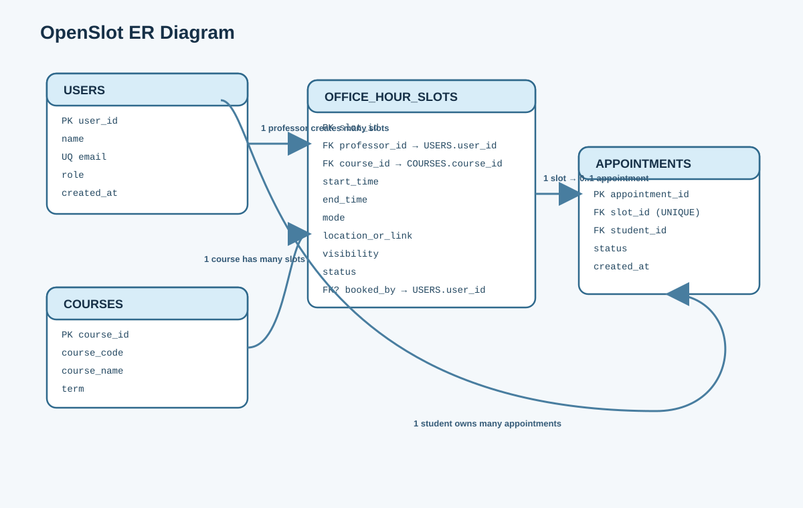

# OpenSlot ER Diagram

This page is intended for quick GitHub visibility of the database structure used in Milestone 02.

PlantUML source:
- `docs/milestone-02/er-diagram.puml`

## Diagram Preview



## PlantUML Source

```plantuml
@startuml
hide circle
skinparam backgroundColor #F4F8FB
skinparam entity {
  BackgroundColor #FFFFFF
  BorderColor #2F698C
  FontColor #163047
}
skinparam linetype ortho

entity "USERS" as USERS {
  * user_id : INTEGER <<PK>>
  --
  name : VARCHAR(120)
  email : VARCHAR(255) <<UNIQUE>>
  role : VARCHAR(20)
  created_at : TIMESTAMP
}

entity "COURSES" as COURSES {
  * course_id : INTEGER <<PK>>
  --
  course_code : VARCHAR(20)
  course_name : VARCHAR(160)
  term : VARCHAR(40)
}

entity "OFFICE_HOUR_SLOTS" as SLOTS {
  * slot_id : INTEGER <<PK>>
  --
  professor_id : INTEGER <<FK>>
  course_id : INTEGER <<FK>>
  start_time : TIMESTAMP
  end_time : TIMESTAMP
  mode : VARCHAR(20)
  location_or_link : VARCHAR(300)
  visibility : VARCHAR(20)
  status : VARCHAR(20)
  booked_by : INTEGER <<FK, NULL>>
  notes : TEXT
  created_at : TIMESTAMP
  updated_at : TIMESTAMP
}

entity "APPOINTMENTS" as APPOINTMENTS {
  * appointment_id : INTEGER <<PK>>
  --
  slot_id : INTEGER <<FK, UNIQUE>>
  student_id : INTEGER <<FK>>
  status : VARCHAR(20)
  notes : TEXT
  created_at : TIMESTAMP
}

USERS ||--o{ SLOTS : "creates (professor_id)"
COURSES ||--o{ SLOTS : "categorizes (course_id)"
USERS ||--o{ APPOINTMENTS : "owns (student_id)"
SLOTS ||--o| APPOINTMENTS : "is booked by"
USERS o|--o{ SLOTS : "optional booked_by"
@enduml
```

## Core Entities

- `USERS`
  - Stores students and professors
  - Key fields: `user_id`, `email`, `role`

- `COURSES`
  - Stores courses used to organize office-hour availability
  - Key fields: `course_id`, `course_code`, `course_name`, `term`

- `OFFICE_HOUR_SLOTS`
  - Stores professor-created availability slots
  - Key fields: `slot_id`, `professor_id`, `course_id`, `start_time`, `end_time`, `status`

- `APPOINTMENTS`
  - Stores student bookings for slots
  - Key fields: `appointment_id`, `slot_id`, `student_id`, `status`

## Relationship Summary

- One professor can create many office-hour slots.
- One course can have many office-hour slots.
- One office-hour slot can have zero or one appointment.
- One student can own many appointments.

## Source Files

- PlantUML source: `docs/milestone-02/er-diagram.puml`
- Diagram asset: `docs/milestone-02/er-diagram.svg`
- Database notes: `docs/milestone-02/database-design.md`
- SQL schema: `db/schema.sql`
